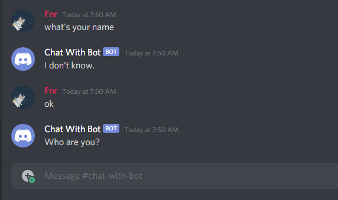

# chat-with-bot Made by Fnr#9999

<h1 align="center"> Advanced Discord Music Bot </h1>

- get started

1- First create file named "config.json"<br>2- npm install<br>3- You need to create channel named "chat-with-bot" for using the bot

- config.json
```
{
    "token": "Your discord bot token"
}
```

simple chat wiht bot

**Thanks for using me**
